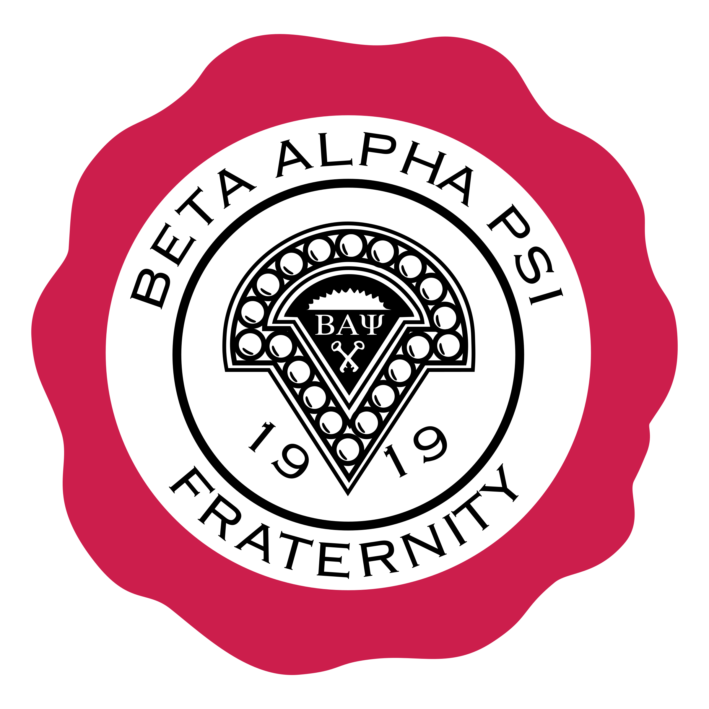

<div id="top">

<!-- HEADER STYLE: CLASSIC -->
<div align="center">



# INFORMANU

<em>Empowering Smarter Conversations, Seamlessly and Securely</em>

<!-- BADGES -->


<em>Built with the tools and technologies:</em>


</div>
<br>

---

## 📄 Table of Contents

- [Overview](#-overview)
- [Getting Started](#-getting-started)
    - [Prerequisites](#-prerequisites)
    - [Installation](#-installation)
    - [Local Development](#-local-development)
    - [Deployment](#-deployment)
    - [Usage](#-usage)
- [Features](#-features)
- [Knowledge Base](#-knowledge-base)
- [Project Structure](#-project-structure)
- [Troubleshooting](#-troubleshooting)
- [Contributing](#-contributing)
- [License](#-license)
- [Acknowledgment](#-acknowledgment)

---

## ✨ Overview

InformaNu is a comprehensive Q&A chatbot for BAP-NuSigma, leveraging OpenAI and document-based answers. It simplifies creating conversational experiences that are both visually appealing and contextually accurate.

**Why InformaNu?**

This project enables chapter members to rapidly access information about policies, requirements, and schedules through an intelligent chatbot interface. The core features include:

- **🧩** **Styled Chat Templates:** Standardized HTML and CSS for visually distinct user and bot messages, ensuring a cohesive conversational UI.
- **🚀** **Cloud Deployment Configuration:** Streamlined setup with YAML files to deploy your chatbot seamlessly in cloud environments.
- **🤖** **AI-Powered Q&A:** Integration with OpenAI GPT-3.5 for dynamic, context-aware responses based on knowledge base content.
- **📄** **Document Processing:** Efficiently loads and indexes PDFs, Word documents, and Markdown files for accurate information retrieval.
- **🔧** **Dependency Management:** Ensures smooth setup with a dedicated requirements file for all necessary libraries.
- **🤝** **Collaborative Development:** Clear ownership and contribution guidelines to foster effective teamwork.

---

## 📌 Features

|      | Component       | Details                                                                                     |
| :--- | :-------------- | :------------------------------------------------------------------------------------------ |
| ⚙️  | **Architecture**  | <ul><li>Modular design separating data ingestion, processing, and UI layers</li><li>Utilizes a pipeline approach with LangChain for chaining components</li></ul> |
| 🔩 | **Code Quality**  | <ul><li>Follows PEP8 standards</li><li>Uses type hints extensively</li><li>Includes docstrings for major modules</li></ul> |
| 📄 | **Documentation** | <ul><li>Comprehensive README with setup, usage, and architecture overview</li><li>Includes inline comments and docstrings</li></ul> |
| 🔌 | **Integrations**  | <ul><li>OpenAI API for LLM functionalities</li><li>FAISS for vector similarity search</li><li>PyPDF2 and python-docx for document parsing</li><li>Streamlit for web interface</li></ul> |
| 🧩 | **Modularity**    | <ul><li>Separated modules for document ingestion, embedding, and querying</li><li>Configurable via YAML (`render.yaml`)</li></ul> |
| 🧪 | **Testing**       | <ul><li>Basic unit tests present in `/tests` directory</li><li>Uses pytest framework</li></ul> |
| ⚡️  | **Performance**   | <ul><li>Leverages FAISS for fast similarity search</li><li>Asynchronous API calls for OpenAI</li></ul> |
| 🛡️ | **Security**      | <ul><li>API keys managed via environment variables (`python-dotenv`)</li><li>Minimal attack surface, no exposed endpoints</li></ul> |
| 📦 | **Dependencies**  | <ul><li>Managed via `requirements.txt`</li><li>Includes core libraries: `python`, `faiss-cpu`, `openai`, `langchain`, `streamlit`, `PyPDF2`, `python-docx`, `tiktoken`</li></ul> |

---

## 📚 Knowledge Base

The bot is trained on the following documents:
- **BAP National Policies** - Comprehensive national organization policies
- **Candidate Requirements** - Requirements for chapter candidates
- **Member Requirements** - Requirements for active members
- **Membership Types and Requirements** - Different membership categories and their requirements
- **Officer Roles** - Responsibilities and roles of chapter officers
- **Social Media Policy** - Guidelines for social media usage
- **Spring 2025 Schedule** - Upcoming events and meetings schedule

---

## 📁 Project Structure

```sh
└── InformaNu/
    ├── .github
    │   └── CODEOWNERS
    ├── LICENSE
    ├── README.md
    ├── htmlTemplates.py
    ├── knowledge_base
    │   ├── BAP-National-Policies.pdf
    │   ├── Candidate Requirements.docx
    │   ├── Member Requirements.docx
    │   ├── Membership Types and Requirements.docx
    │   ├── Officer Roles.docx
    │   ├── beta-alpha-psi-social-media-policy-2020_final.pdf
    │   └── spring_2025_schedule.md
    ├── render.yaml
    ├── requirements.txt
    └── streamlit_app.py
```

---

## 🚀 Getting Started

### 📋 Prerequisites

This project requires the following dependencies:

- **Programming Language:** Python 3.8+
- **Package Manager:** Pip
- **OpenAI API Key:** Required for AI functionality

### ⚙️ Installation

Build InformaNu from the source and install dependencies:

1. **Clone the repository:**

    ```sh
    ❯ git clone https://github.com/BAPNuSigma/InformaNu
    ```

2. **Navigate to the project directory:**

    ```sh
    ❯ cd InformaNu
    ```

3. **Install the dependencies:**

**Using [pip](https://pypi.org/project/pip/):**

```sh
❯ pip install -r requirements.txt
```

### 💻 Local Development

1. **Set Up Secrets**
   Create a file at `.streamlit/secrets.toml` with the following structure:
   ```toml
   [openai]
   api_key = "your-openai-api-key"
   ```

2. **Run the App**
   ```sh
   ❯ streamlit run streamlit_app.py
   ```

### ☁️ Deployment on Render

1. **Push your code to GitHub**
2. **Create a new Web Service on [Render](https://render.com/)**
3. **Set Environment Variables** in the Render dashboard:
   - `OPENAI_API_KEY`: Your OpenAI API key
4. **Deploy!**

The app will automatically use environment variables in production and `secrets.toml` locally.

### 🎯 Usage

- Ask questions about your chapter or national policies
- The bot will answer using only the information in the indexed documents
- If the answer is not found, the bot will say so
- The bot maintains context of the conversation for more natural interactions

---

## 🧪 Testing

InformaNu uses the pytest test framework. Run the test suite with:

**Using [pip](https://pypi.org/project/pip/):**

```sh
pytest
```

---

## 🔧 Troubleshooting

| Issue | Solution |
|-------|----------|
| **No secrets file found** | Make sure you have `.streamlit/secrets.toml` locally, or environment variables set on Render |
| **No documents found** | Check if the knowledge_base directory contains the required documents |
| **API Key Issues** | Verify your OpenAI API key is correctly set in secrets or environment variables |
| **ModuleNotFoundError: No module named 'docx'** | Ensure `python-docx` is installed: `pip install python-docx` |
| **Build cache issues on Render** | Use "Clear build cache & deploy" option in Render dashboard |

---

## 📈 Roadmap

- [X] **`Task 1`**: <strike>Implement basic Q&A functionality.</strike>
- [X] **`Task 2`**: <strike>Add document processing capabilities.</strike>
- [X] **`Task 3`**: <strike>Deploy to cloud platform.</strike>
- [ ] **`Task 4`**: Implement advanced conversation features.
- [ ] **`Task 5`**: Add multi-language support.

---

## 🤝 Contributing

- **💬 [Join the Discussions](https://github.com/BAPNuSigma/InformaNu/discussions)**: Share your insights, provide feedback, or ask questions.
- **🐛 [Report Issues](https://github.com/BAPNuSigma/InformaNu/issues)**: Submit bugs found or log feature requests for the `InformaNu` project.
- **💡 [Submit Pull Requests](https://github.com/BAPNuSigma/InformaNu/blob/main/CONTRIBUTING.md)**: Review open PRs, and submit your own PRs.

<details closed>
<summary>Contributing Guidelines</summary>

1. **Fork the Repository**: Start by forking the project repository to your github account.
2. **Clone Locally**: Clone the forked repository to your local machine using a git client.
   ```sh
   git clone https://github.com/BAPNuSigma/InformaNu
   ```
3. **Create a New Branch**: Always work on a new branch, giving it a descriptive name.
   ```sh
   git checkout -b new-feature-x
   ```
4. **Make Your Changes**: Develop and test your changes locally.
5. **Commit Your Changes**: Commit with a clear message describing your updates.
   ```sh
   git commit -m 'Implemented new feature x.'
   ```
6. **Push to github**: Push the changes to your forked repository.
   ```sh
   git push origin new-feature-x
   ```
7. **Submit a Pull Request**: Create a PR against the original project repository. Clearly describe the changes and their motivations.
8. **Review**: Once your PR is reviewed and approved, it will be merged into the main branch. Congratulations on your contribution!
</details>

<details closed>
<summary>Contributor Graph</summary>
<br>
<p align="left">
   <a href="https://github.com{/BAPNuSigma/InformaNu/}graphs/contributors">
      
   </a>
</p>
</details>

---

## 📜 License

InformaNu is protected under the [MIT License](https://choosealicense.com/licenses/mit/). For more details, refer to the [LICENSE](LICENSE) file.

---

## ✨ Acknowledgments

- **Beta Alpha Psi Nu Sigma Chapter** - For providing the knowledge base and requirements
- **OpenAI** - For providing the GPT-3.5 API
- **Streamlit** - For the web framework
- **LangChain** - For the AI/ML framework
- **Contributors** - All those who have contributed to this project

<div align="left"><a href="#top">⬆ Return</a></div>

---

