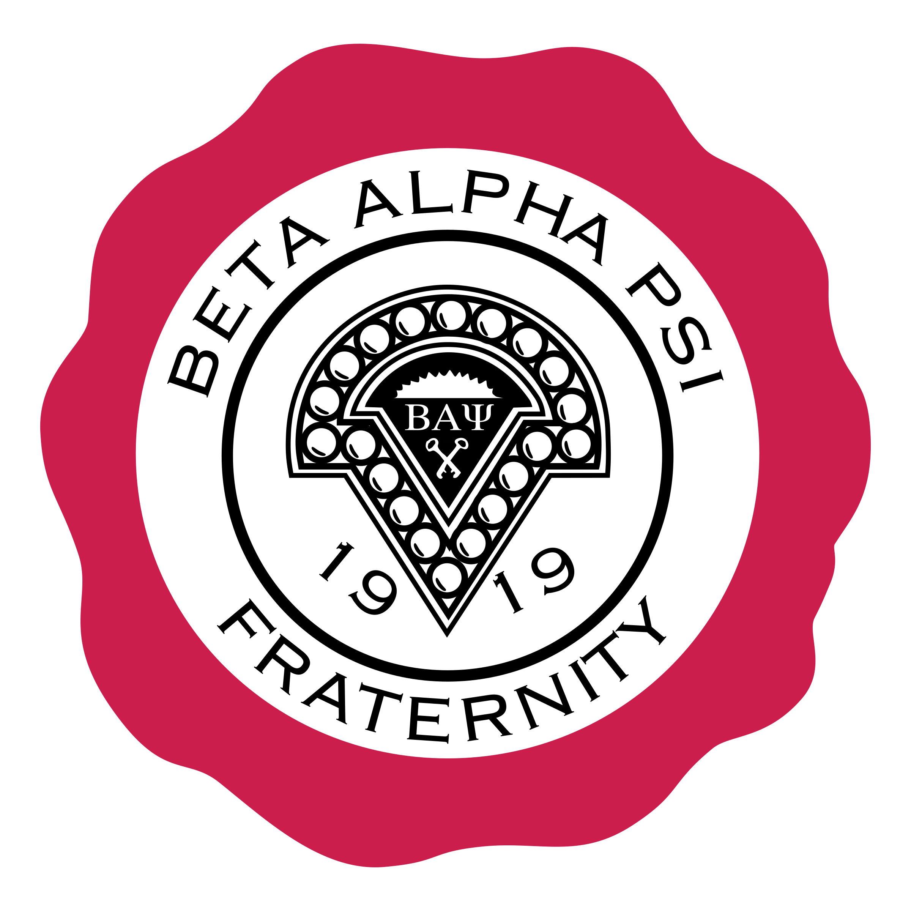

<div id="top">

<!-- HEADER STYLE: CLASSIC -->
<div align="center">



# INFORMANU

<em>Empowering Smarter Conversations, Seamlessly and Securely</em>

<!-- BADGES -->


<em>Built with the tools and technologies:</em>


</div>
<br>

---

## 📄 Table of Contents

- [Overview](#-overview)
- [Architecture](#-architecture)
- [Knowledge Base](#-knowledge-base)
- [Project Structure](#-project-structure)
- [Local Development](#-local-development)
- [Vercel Deployment](#-vercel-deployment)
- [Legacy Streamlit Deployment](#-legacy-streamlit-deployment)
- [Testing](#-testing)
- [Troubleshooting](#-troubleshooting)
- [Contributing](#-contributing)
- [License](#-license)
- [Acknowledgment](#-acknowledgment)

---

## ✨ Overview

InformaNu is a Q&A chatbot for the Beta Alpha Psi Nu Sigma chapter. It answers
chapter-related questions using only the committed knowledge base and the
OpenAI API. The public Vercel deployment runs a **Next.js App Router** frontend
that talks to a server-side API route. The OpenAI API key never reaches the
browser.

---

## 🏗️ Architecture

- **Frontend:** Next.js 15 App Router + React 19 + TypeScript.
- **Styling:** Plain CSS modules (`src/app/globals.css`).
- **Chat API:** `POST /api/chat` — server-side route using the official OpenAI
  Node SDK with the **Responses API**.
- **Knowledge base:** Source documents live in `knowledge_base/`. A development
  script (`npm run generate:knowledge`) extracts them into
  `src/data/knowledge-base.json`, which is imported by the API route at build
  time. Documents are **not** parsed on every request.
- **State:** Chat history is held in React client-side state. No database is used.
- **Secrets:** `OPENAI_API_KEY` is read only inside `src/lib/openai.ts` and the
  `/api/chat` route.

---

## 📚 Knowledge Base

The bot is grounded in the following committed documents:

- **BAP National Policies**
- **Candidate Requirements**
- **Member Requirements**
- **Membership Types and Requirements**
- **Officer Roles**
- **Social Media Policy**
- **Spring 2026 Schedule**

To regenerate the extracted artifact after editing source documents:

```sh
npm run generate:knowledge
```

The script reports any extraction failures and writes the deterministic artifact
to `src/data/knowledge-base.json`.

---

## 📁 Project Structure

```sh
InformaNu/
├── .github
│   └── CODEOWNERS
├── knowledge_base/           # Source PDF, DOCX, and Markdown documents
├── scripts/
│   └── generate-knowledge-base.py   # Build-time extraction script
├── src/
│   ├── app/
│   │   ├── api/chat/route.ts        # Server-side OpenAI streaming route
│   │   ├── globals.css
│   │   ├── layout.tsx
│   │   └── page.tsx
│   ├── components/
│   │   ├── Chat.tsx
│   │   └── ChatMessage.tsx
│   ├── data/
│   │   └── knowledge-base.json      # Generated text artifact
│   └── lib/
│       ├── config.ts
│       ├── knowledge.ts
│       ├── openai.ts
│       └── validation.ts
├── .env.example
├── .gitignore
├── .nvmrc
├── LICENSE
├── README.md
├── htmlTemplates.py          # Legacy Streamlit assets
├── next.config.ts
├── package.json
├── package-lock.json
├── render.yaml               # Legacy Render deployment config
├── requirements.txt          # Legacy Python dependencies
├── streamlit_app.py          # Legacy Streamlit application
└── tsconfig.json
```

---

## 💻 Local Development

### Prerequisites

- Node.js `20.x` (use `.nvmrc` or `nvm use`)
- An OpenAI API key

### Installation

```sh
npm install
```

Copy the example environment file and add your OpenAI key:

```sh
cp .env.example .env.local
```

Edit `.env.local`:

```sh
OPENAI_API_KEY=sk-...
# Optional: OPENAI_MODEL=gpt-4o-mini
```

> Do **not** commit `.env.local` or any file containing secrets.

### Run the development server

```sh
npm run dev
```

Open [http://localhost:3000](http://localhost:3000).

### Set up the Python extraction environment (for knowledge-base regeneration)

The knowledge-base source documents are PDF and DOCX files. A Python script
extracts them into `src/data/knowledge-base.json`. Create a local Python virtual
environment once:

```sh
python3 -m venv .venv-py
source .venv-py/bin/activate
pip install -r requirements.txt
```

### Regenerate the knowledge-base artifact

```sh
npm run generate:knowledge
```

---

## 🚀 Vercel Deployment

### Required Vercel Project Settings

| Setting | Value |
| --- | --- |
| **Root directory** | `./` (repository root) |
| **Framework preset** | Next.js |
| **Build command** | `next build` |
| **Install command** | `npm install` |
| **Output directory** | default (`.next`) |
| **Node.js version** | `22.x` (from `package.json` `engines` or `.nvmrc`) |

### Required Environment Variables

Add these in the Vercel dashboard under **Project Settings → Environment Variables**:

| Name | Required | Value |
| --- | --- | --- |
| `OPENAI_API_KEY` | Yes | Your OpenAI API key |
| `OPENAI_MODEL` | No | Any OpenAI model ID. Defaults to `gpt-4o-mini`. |

### Deployment Steps

1. Push the repository to GitHub.
2. Import the project into Vercel.
3. Confirm the framework preset is **Next.js**.
4. Add `OPENAI_API_KEY` in the environment variables.
5. Deploy.
6. Verify that the chat page loads and responds to a question.

### Manual Verification Checklist

- [ ] Homepage loads at the Vercel URL.
- [ ] A welcome message and chat input are visible.
- [ ] Submitting a question returns a streaming assistant response.
- [ ] Responses reference chapter-specific information from the knowledge base.
- [ ] Submitting an unrelated question yields the “I don’t have that information” behavior.
- [ ] No `OPENAI_API_KEY` is exposed in browser dev tools or network traffic.

---

## 🛡️ Production Security

The public `/api/chat` endpoint streams responses from the OpenAI API and is
therefore a candidate for accidental abuse. Protect it **after** the initial
Vercel deployment using only Vercel-native controls (no Redis, database, or
third-party service is required):

| Control | Recommendation |
| --- | --- |
| **Vercel WAF rate limiting** | Create a rule scoped to `POST /api/chat` that allows **10 requests per minute per source IP**. Return `429 Too Many Requests` for excess traffic. |
| **Vercel Bot Protection** | Enable **Challenge mode** so automated bots must pass a challenge before reaching the endpoint. |

These settings are configured in the Vercel dashboard under the project’s
**Security** tab. Adjust the rate limit once you have real traffic data.

---

## 🖥️ Legacy Streamlit Deployment

The original Render/Streamlit implementation is intentionally preserved as a
rollback path while the Vercel deployment is being verified.

Legacy files:

- `streamlit_app.py`
- `htmlTemplates.py`
- `requirements.txt`
- `render.yaml`

To deploy on Render, create a Python web service and set the `OPENAI_API_KEY`
environment variable. The start command in `render.yaml` is:

```sh
streamlit run streamlit_app.py --server.port $PORT
```

Do not delete these files until the Vercel deployment is tested and approved.

---

## 🧪 Testing

Run the validation and knowledge-base tests:

```sh
npm test
```

Run TypeScript checks:

```sh
npm run typecheck
```

Run ESLint:

```sh
npm run lint
```

Run the production build:

```sh
npm run build
```

---

## 🔧 Troubleshooting

| Issue | Solution |
| --- | --- |
| `OPENAI_API_KEY` errors | Ensure the key is set in `.env.local` locally or in Vercel project settings. |
| No responses from the bot | Check the Vercel function logs for OpenAI errors. |
| Knowledge base appears empty | Run `npm run generate:knowledge` and verify `src/data/knowledge-base.json` was generated. |
| `npm install` engine warnings | Use Node `22.x` (via `nvm` or `fnm`) or ignore the local warning; Vercel uses the `engines` value. |

---

## 📜 License

InformaNu is licensed under the **Apache License 2.0**. See the [`LICENSE`](./LICENSE) file for details.

---

## ✨ Acknowledgments

- **Jack Mitchell** - For becoming the Founding Father and Creator of InformaNu
- **Beta Alpha Psi Nu Sigma Chapter** - For providing the knowledge base and requirements
- **OpenAI** - For providing the GPT models
- **Next.js / Vercel** - For the hosting and React framework
- **Contributors** - All those who have contributed to this project

<div align="left"><a href="#top">⬆ Return</a></div>

---
